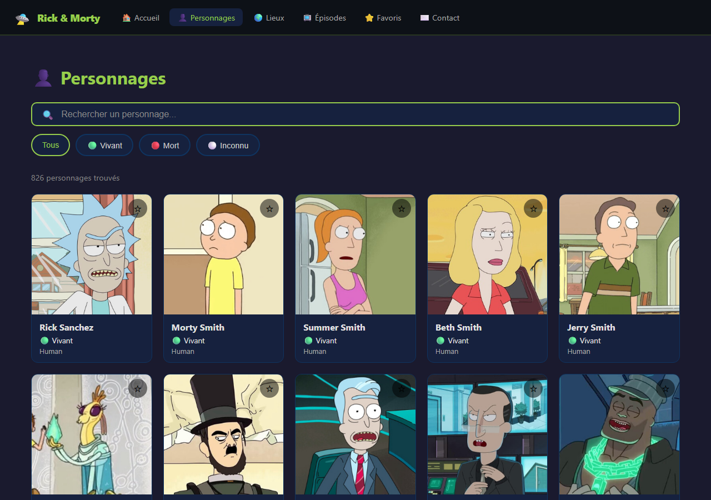
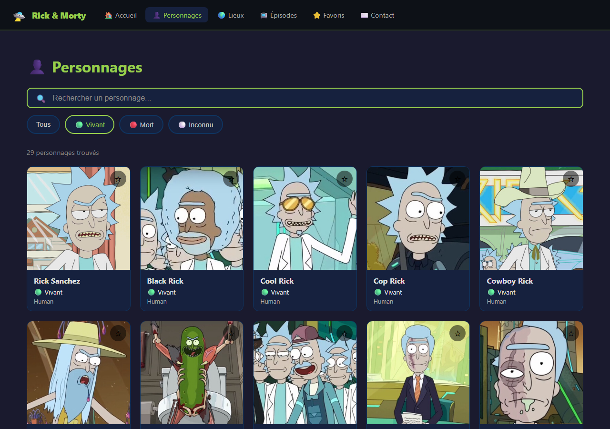
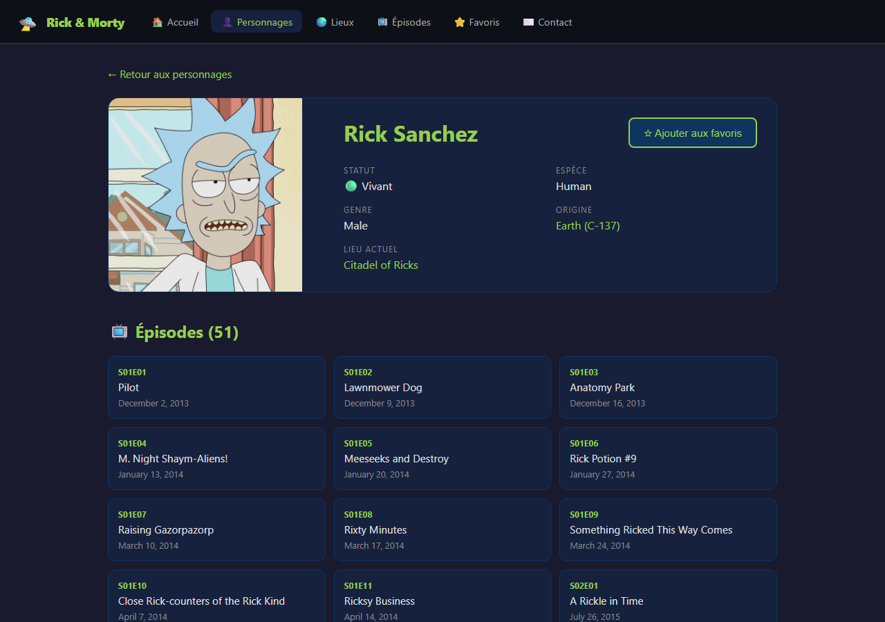
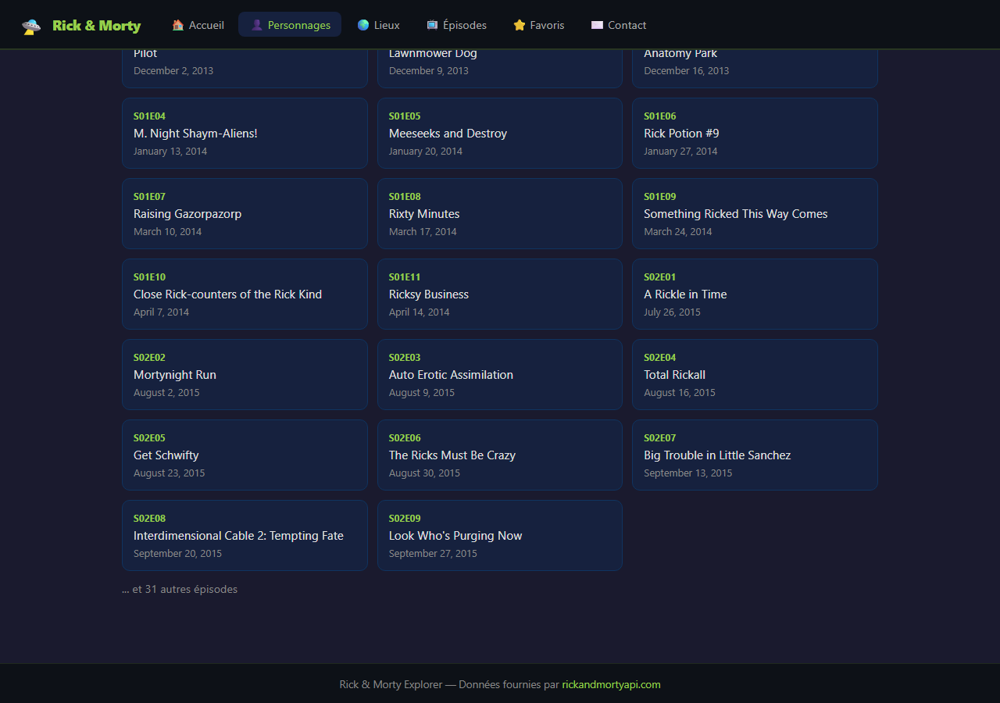
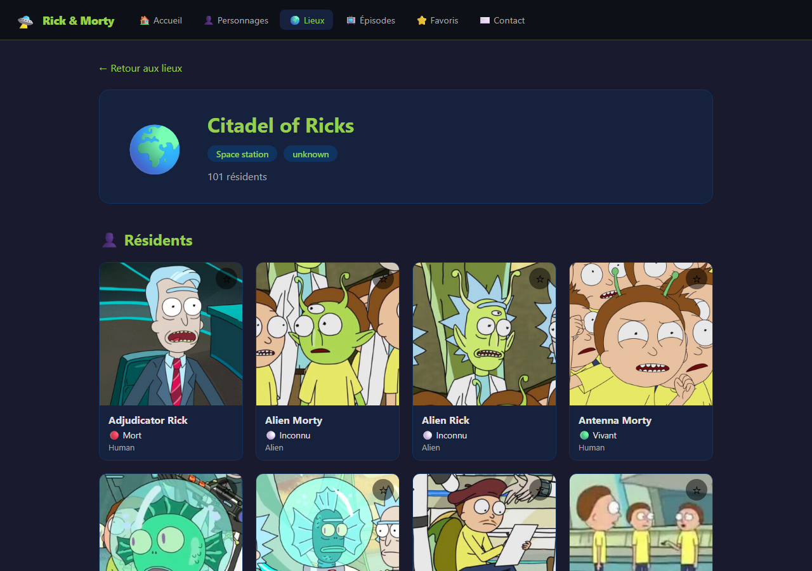
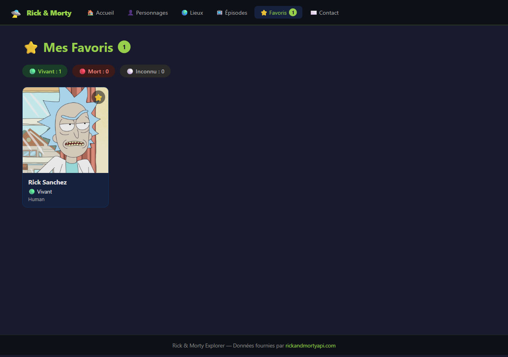
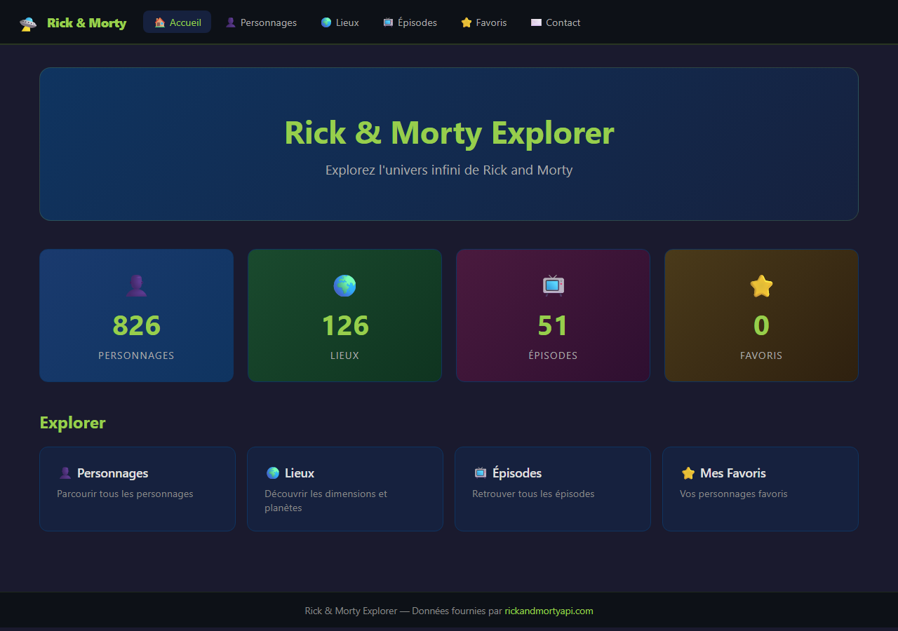
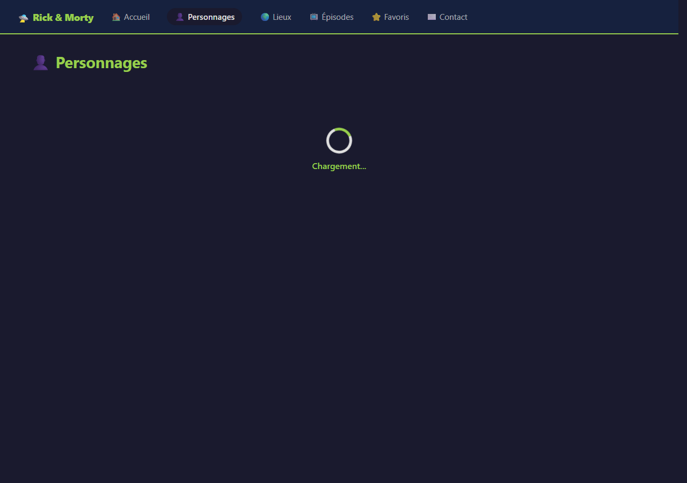
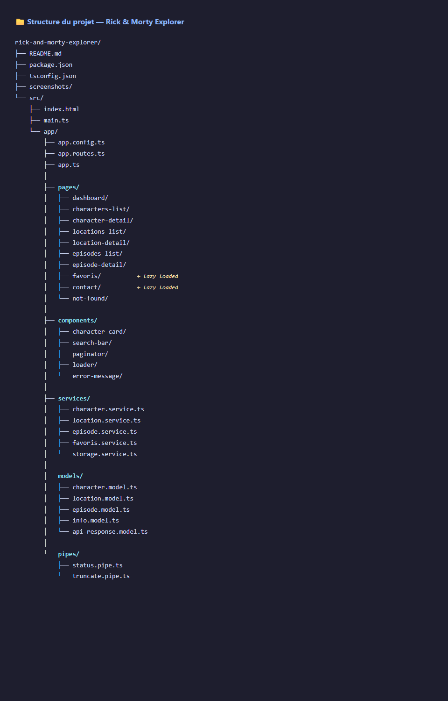

# Rick & Morty Explorer

Application Angular de type SPA permettant d'explorer les personnages, lieux et épisodes de l'univers Rick & Morty, via l'API publique [rickandmortyapi.com](https://rickandmortyapi.com).

---

## Lancer l'application

```bash
npm install
npm start
```

Puis ouvrir [http://localhost:4200](http://localhost:4200).

---

## Fonctionnalités réalisées

### Bloc A — Modèles & Services
- [x] `info.model.ts` — interface `Info`
- [x] `api-response.model.ts` — interface générique `ApiResponse<T>`
- [x] `character.model.ts` — interface `Character`
- [x] `location.model.ts` — interface `Location`
- [x] `episode.model.ts` — interface `Episode`
- [x] `CharacterService` — `getAll`, `getById`, `getMany`
- [x] `LocationService` — `getAll`, `getById`
- [x] `EpisodeService` — `getAll`, `getById`, `getMany`
- [x] `FavorisService` — signal + computed + persistance
- [x] `StorageService` — encapsule localStorage

### Bloc B — Pages & Navigation
- [x] `dashboard` — statistiques globales
- [x] `characters-list` — liste paginée + recherche + filtre status
- [x] `character-detail` — fiche personnage avec origine, lieu et épisodes (liens)
- [x] `locations-list` — liste paginée
- [x] `location-detail` — fiche lieu avec résidents (liens)
- [x] `episodes-list` — liste paginée
- [x] `episode-detail` — fiche épisode avec personnages (liens)
- [x] `favoris` — lazy loaded
- [x] `contact` — lazy loaded
- [x] `not-found` — page 404
- [x] Routes configurées avec `withComponentInputBinding()`
- [x] `id` récupéré via `input.required<string>()`

### Bloc C — Interactions
- [x] Recherche par nom avec `debounceTime(300)` + `distinctUntilChanged()`
- [x] Filtre par status (Alive / Dead / unknown)
- [x] Pagination (Précédent / Suivant) sur les 3 listes
- [x] Favoris avec `signal` + `computed`, persistés via `localStorage`
- [x] Dashboard avec statistiques via `computed`
- [x] Formulaire réactif avec validation (`required`, `minLength`, `email`)

### Bloc D — Composants, pipes & qualité
- [x] `CharacterCardComponent` — `input()` + `output()`
- [x] `SearchBarComponent` — `output()` le terme, `debounceTime` interne
- [x] `PaginatorComponent` — `input()` page/total, `output()` prev/next
- [x] `LoaderComponent` — indicateur de chargement
- [x] `ErrorMessageComponent` — `input()` message, `output()` retry
- [x] `StatusPipe` — `Alive → 🟢 Vivant`, `Dead → 🔴 Mort`, `unknown → ⚪ Inconnu`
- [x] `TruncatePipe` — tronque à N caractères
- [x] `ChangeDetectionStrategy.OnPush` sur tous les composants dumb et pages liste/détail
- [x] Désabonnement propre : `takeUntil(destroy$)` + `ngOnDestroy`
- [x] TypeScript strict, aucun `any`
- [x] Architecture en dossiers : `pages/`, `components/`, `services/`, `models/`, `pipes/`

---

## Design patterns utilisés

| Pattern | Où | Pourquoi |
|---|---|---|
| **Singleton** | `CharacterService`, `LocationService`, `EpisodeService`, `FavorisService`, `StorageService` (`providedIn: 'root'`) | Une seule instance partagée dans toute l'app |
| **Smart / Dumb components** | Pages (smart) vs `CharacterCardComponent`, `PaginatorComponent`… (dumb) | Séparation des responsabilités, composants dumb réutilisables et testables |
| **Observable pattern** | `HttpClient`, `Subject` dans `SearchBarComponent` et `CharactersListComponent` | Flux asynchrones composables |
| **Signal + computed** | `FavorisService`, `DashboardComponent` | Réactivité fine-grained, pas d'abonnement manuel |
| **Repository pattern** | Chaque service HTTP (`CharacterService`…) | Découple les composants de la source de données |

---

## Réponses aux questions

### 1. Composant « smart » vs « dumb » ?

Un composant **smart** orchestre la logique métier : il injecte des services, déclenche des appels HTTP et gère l'état local via des signaux. Exemple dans ce projet : `CharactersListComponent`, qui injecte `CharacterService` et `FavorisService`, applique les filtres et gère la pagination.

Un composant **dumb** (ou présentationnel) ne connaît aucun service : il reçoit ses données via `input()` et notifie le parent via `output()`. Exemple : `CharacterCardComponent`, qui reçoit un `Character` en entrée et émet `toggleFavori` sans savoir comment les données sont obtenues.

---

### 2. Pourquoi `OnPush` ? Quel lien avec l'immutabilité ?

`ChangeDetectionStrategy.OnPush` indique à Angular de ne vérifier un composant que si une référence d'`input()` change, si un événement DOM est émis depuis lui, ou si un signal/Observable lié émet. Cela évite des vérifications inutiles sur tout l'arbre à chaque cycle.

Le lien avec l'immutabilité est direct : pour que `OnPush` détecte un changement, il faut que la référence de l'objet change. C'est pourquoi `FavorisService` utilise `signal.update(list => [...list, c])` — créer un nouveau tableau au lieu de muter l'existant garantit qu'Angular voit bien un changement de référence.

---

### 3. Pourquoi le `pipe async` plutôt qu'un `subscribe()` manuel ?

Le `pipe async` souscrit à un Observable dans le template et **se désabonne automatiquement** quand le composant est détruit. Un `subscribe()` non nettoyé continue à vivre en mémoire après la destruction du composant, peut tenter de modifier un composant détruit et provoque des fuites mémoire. Avec `pipe async`, ce risque est entièrement éliminé sans code supplémentaire.

---

### 4. `providedIn: 'root'` : quel design pattern ? Combien d'instances ?

C'est le pattern **Singleton**. Angular crée l'instance du service une seule fois dans l'injecteur racine et la partage avec tous les composants qui l'injectent. Il n'existe donc qu'**une seule instance** de `CharacterService` dans toute l'application — peu importe combien de composants l'injectent.

---

### 5. Différence entre un `signal` et un `BehaviorSubject` ?

Un `BehaviorSubject` (RxJS) est un Observable qui mémorise sa dernière valeur ; il s'utilise avec `.next()` pour émettre et `.value` pour lire, et nécessite un désabonnement explicite. Un `signal` (Angular) est une primitive réactive native, lisible directement via `signal()` et modifiable via `.set()` / `.update()` — sans abonnement ni nettoyage.

J'ai choisi un `signal` pour les favoris car l'état est synchrone et simple, et il s'intègre nativement avec `computed()` pour dériver `nombre` et `parStatut` sans aucun overhead RxJS.

---

### 6. Pourquoi `switchMap` (et pas `mergeMap`) ? À quoi sert `debounceTime` ?

`switchMap` **annule** la requête HTTP en cours si une nouvelle valeur arrive avant qu'elle soit terminée. C'est indispensable pour la recherche : si l'utilisateur tape "rick" rapidement, seule la requête finale doit aboutir — les intermédiaires sont annulées. `mergeMap` laisserait toutes les requêtes s'exécuter en parallèle, ce qui pourrait afficher des résultats périmés dans le désordre.

`debounceTime(300)` attend 300 ms d'inactivité avant d'émettre la valeur, ce qui évite de déclencher un appel HTTP à chaque frappe de touche.

---

### 7. Reactive Forms vs Template-driven : pourquoi le réactif ?

Les **Reactive Forms** définissent entièrement la structure et les validateurs dans la classe TypeScript (`FormBuilder`, `FormGroup`, `Validators`), ce qui les rend testables unitairement, prévisibles et lisibles. La logique de validation n'est pas dispersée dans le HTML.

Les **Template-driven Forms** utilisent `ngModel` dans le template : la logique est moins explicite, plus difficile à tester et moins adaptée à des validateurs complexes ou dynamiques. Le projet impose le réactif pour la séparation claire des responsabilités et le contrôle fin sur les règles de validation.

---

### 8. Comment sont récupérées les relations entre ressources ?

Les champs `episode` (dans `Character`) et `characters` (dans `Episode`) sont des tableaux d'**URLs** sous la forme `https://rickandmortyapi.com/api/episode/12`. On extrait l'identifiant à la fin avec `url.split('/').pop()`, ce qui donne le nombre entier `12`. Ces ids sont ensuite passés à `getMany(ids)` qui construit l'URL `/api/character/1,2,3` pour récupérer plusieurs ressources en **un seul appel HTTP**.

Exemple dans `CharacterDetailComponent` :
```typescript
const ids = c.episode.map(url => +url.split('/').pop()!);
this.episodeSvc.getMany(ids.slice(0, 20)).subscribe(...);
```

---

### 9. Qu'apporte le lazy loading des routes `favoris` et `contact` ?

Le lazy loading (`loadComponent`) retarde le téléchargement du bundle JavaScript d'une route jusqu'à ce que l'utilisateur la visite pour la première fois. Le bundle initial de l'application est donc plus petit, ce qui accélère le premier affichage de la page. Les routes `favoris` et `contact` étant moins fréquentées, les charger à la demande est un bon compromis performance/expérience utilisateur.

---

### 10. GraphQL vs REST *(bonus non réalisé)*

Non applicable — le bonus GraphQL n'a pas été implémenté dans ce projet.

---

## Captures d'écran

| # | Capture | Description |
|---|---|---|
| 01 |  | Liste paginée des personnages |
| 02 |  | Recherche par nom + filtre status |
| 03 |  | Fiche personnage |
| 04 |  | Liens vers lieu et épisodes depuis un personnage |
| 05 |  | Fiche lieu avec résidents |
| 06 |  | Favoris persistants après rechargement |
| 07 |  | Tableau de bord avec statistiques |
| 08 |  | Formulaire avec messages de validation |
| 09 |  | État chargement et/ou erreur |
| 10 |  | Structure des dossiers |
